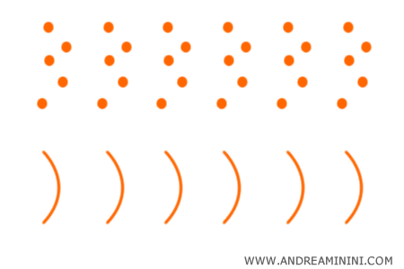
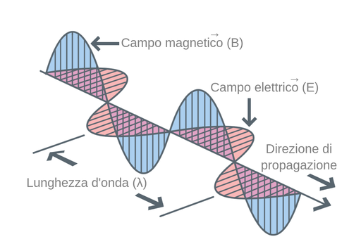
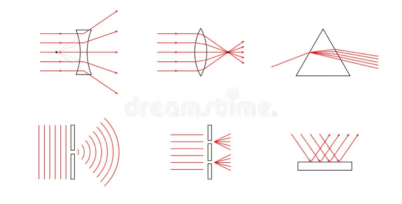
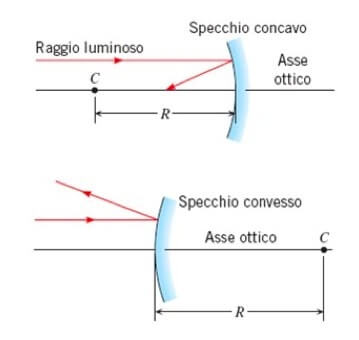
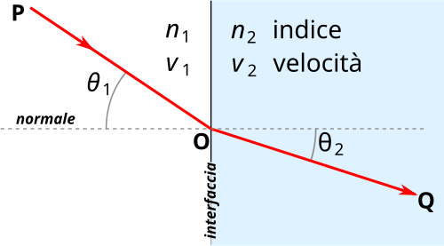
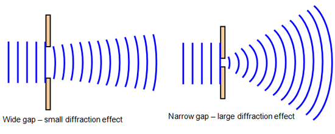
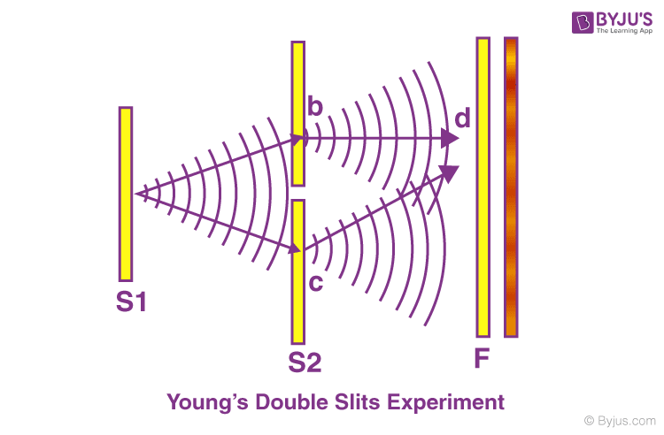

# [Natura della Luce](./simulazioni/index.html) {#natura-della-luce} 

## Cos'è la luce {#cos-e-la-luce}

:::: {.cols .cols-6040}
::: {.col-text}
- La luce è una forma di **energia** che si propaga nello spazio
- Responsabile della visione, della percezione dei colori e permette il trasferimento di energia e informazioni
- Per secoli si è discusso sulla natura della luce e si presentano due modelli:
  - modello **corpuscolare** (particelle)
  - modello **ondulatorio** (onde)
:::
::: {.col-img}

:::
::::

## Dualismo onda-particella {#dualismo-onda-particella}

- La luce presenta una **doppia natura**:
  - si comporta da **particella** (fotone) quando interagisce con la materia
  - si comporta da **onda** quando si propaga nello spazio
- Non è una contraddizione: sono due descrizioni complementari dello stesso fenomeno

## L'Onda Elettromagnetica {.smaller #l-onda-elettromagnetica}

:::: {.cols .cols-6040}
::: {.col-text}

- La luce può essere descritta come un'onda precisamente come un'onda elettromagnetica
- Onda trasversale: campo elettrico $\vec{E}$ e campo magnetico $\vec{B}$ oscillano perpendicolarmente alla direzione di propagazione
- Non richiede un mezzo materiale: si propaga nel vuoto
- Relazione fondamentale: $v = \lambda f$
  dove $\lambda$ = lunghezza d'onda, $f$ = frequenza, $v$ = velocità di propagazione
- $\lambda$ e $f$ sono inversamente proporzionali a velocità fissata

:::
::: {.col-img}

:::
::::

# Lo Spettro Elettromagnetico {#lo-spettro-elettromagnetico}

## Spettro elettromagnetico {#spettro-elettromagnetico}

:::: {.cols .cols-6040}
::: {.col-text}
Tutte le onde EM condividono la stessa natura, differiscono solo per $\lambda$ e $f$

| **Radiazione** | **$\lambda$** | **Uso** |
|-------------------|---------------------|----------------------|
| Onde radio        | da cm a km          | Telecomunicazioni    |
| Microonde         | mm ÷ cm             | Radar, Wi-Fi         |
| Infrarosso        | 780 nm ÷ 1 mm       | Termografia          |
| **Luce visibile** | **380 ÷ 780 nm** | **Visione** |
| Ultravioletto     | 10 ÷ 380 nm         | Sterilizzazione      |
| Raggi X           | 0.01 ÷ 10 nm        | Diagnostica          |
| Raggi Gamma       | < 0.01 nm           | Fisica nucleare      |
:::
::: {.col-img}
<!-- spettro-em: barra orizzontale con 7 bande + gradiente arcobaleno per il visibile -->
<svg viewBox="0 0 300 160" xmlns="http://www.w3.org/2000/svg" style="width:100%;font-family:sans-serif;">
  <defs>
    <linearGradient id="rainbow" x1="0" y1="0" x2="1" y2="0">
      <stop offset="0%"   stop-color="#7B00FF"/>
      <stop offset="20%"  stop-color="#4400EE"/>
      <stop offset="35%"  stop-color="#0055FF"/>
      <stop offset="50%"  stop-color="#00CC00"/>
      <stop offset="65%"  stop-color="#FFEE00"/>
      <stop offset="80%"  stop-color="#FF8800"/>
      <stop offset="100%" stop-color="#FF0000"/>
    </linearGradient>
  </defs>
  <!-- Frecce -->
  <line x1="10" y1="148" x2="290" y2="148" stroke="#333" stroke-width="1.2"/>
  <polygon points="290,148 282,144 282,152" fill="#333"/>
  <text x="150" y="160" text-anchor="middle" font-size="9" fill="#333">&#955; crescente &#8594;</text>
  <line x1="290" y1="30" x2="10" y2="30" stroke="#333" stroke-width="1.2"/>
  <polygon points="10,30 18,26 18,34" fill="#333"/>
  <text x="150" y="45" text-anchor="middle" font-size="9" fill="#333">&#8592; frequenza crescente</text>
  <!-- Bande (y=70, h=35) -->
  <rect x="10"  y="70" width="25"  height="35" fill="#9900cc"/>
  <rect x="35"  y="70" width="30"  height="35" fill="#cc00aa"/>
  <rect x="65"  y="70" width="30"  height="35" fill="#8800ff"/>
  <rect x="95"  y="70" width="55"  height="35" fill="url(#rainbow)"/>
  <rect x="150" y="70" width="45"  height="35" fill="#cc4400"/>
  <rect x="195" y="70" width="45"  height="35" fill="#cc8800"/>
  <rect x="240" y="70" width="50"  height="35" fill="#888888"/>
  <!-- Bordo visibile -->
  <rect x="95" y="70" width="55" height="35" fill="none" stroke="#000" stroke-width="1.5"/>
  <!-- Etichette sopra -->
  <text x="22"  y="65" text-anchor="middle" font-size="7.5" fill="#333">&#947;</text>
  <text x="50"  y="65" text-anchor="middle" font-size="7.5" fill="#333">X</text>
  <text x="80"  y="65" text-anchor="middle" font-size="7.5" fill="#333">UV</text>
  <text x="122" y="65" text-anchor="middle" font-size="7.5" fill="#333" font-weight="bold">Visibile</text>
  <text x="172" y="65" text-anchor="middle" font-size="7.5" fill="#333">IR</text>
  <text x="217" y="65" text-anchor="middle" font-size="7.5" fill="#333">&#956;onde</text>
  <text x="265" y="65" text-anchor="middle" font-size="7.5" fill="#333">Radio</text>
  <!-- Etichette lambda sotto -->
  <text x="22"  y="116" text-anchor="middle" font-size="6.5" fill="#555">&lt;0.01nm</text>
  <text x="50"  y="116" text-anchor="middle" font-size="6.5" fill="#555">0.01–10nm</text>
  <text x="80"  y="116" text-anchor="middle" font-size="6.5" fill="#555">10–380nm</text>
  <text x="122" y="116" text-anchor="middle" font-size="6.5" fill="#333" font-weight="bold">380–780nm</text>
  <text x="172" y="116" text-anchor="middle" font-size="6.5" fill="#555">780nm–1mm</text>
  <text x="217" y="116" text-anchor="middle" font-size="6.5" fill="#555">mm–cm</text>
  <text x="265" y="116" text-anchor="middle" font-size="6.5" fill="#555">cm–km</text>
</svg>
:::
::::

## La percezione del Colore {#la-percezione-del-colore}

:::: {.cols .cols-6040}
::: {.col-text}
- La luce bianca contiene **tutte le lunghezze d'onda** del visibile
- Gli oggetti **assorbono** alcune $\lambda$ e **riflettono** le rimanenti
- Il colore percepito = la $\lambda$ riflessa
- Violetto: $\lambda \approx 380$ nm — Rosso: $\lambda \approx 780$ nm
- I fotorecettori della retina (coni) rilevano tre bande: rosso, verde, blu
:::
::: {.col-img}
<!--
  prisma-colori: raggio bianco → prisma → dispersione in spettro.
  Prisma: triangolo con vertici top=(160,18), bl=(88,142), br=(232,142).
  Raggio incidente orizzontale: y=83, colpisce la faccia sinistra a (122,83).
  Raggio interno fino al punto di uscita sulla faccia destra ≈ (205,100).
  7 raggi dispersi emergenti verso destra con angoli crescenti (violetto = più deviato).
-->
<svg viewBox="0 0 300 175" xmlns="http://www.w3.org/2000/svg" style="width:100%;font-family:serif;">
  <!-- Prisma -->
  <polygon points="160,18 88,142 232,142" fill="#e8f0ff" stroke="#333" stroke-width="2"/>
  <!-- Raggio incidente bianco -->
  <line x1="15" y1="83" x2="122" y2="83" stroke="#555" stroke-width="2.5"/>
  <polygon points="122,83 112,79 112,87" fill="#555"/>
  <text x="65" y="76" text-anchor="middle" font-size="10" fill="#333">luce bianca</text>
  <!-- Raggio interno -->
  <line x1="122" y1="83" x2="205" y2="100" stroke="#aaa" stroke-width="1.5" stroke-dasharray="4,3"/>
  <!-- Raggi dispersi emergenti da (205,100), divergenti verso destra -->
  <line x1="205" y1="100" x2="290" y2="58"  stroke="#6600cc" stroke-width="2"/>
  <line x1="205" y1="100" x2="290" y2="68"  stroke="#3300ff" stroke-width="2"/>
  <line x1="205" y1="100" x2="290" y2="80"  stroke="#0066ff" stroke-width="2"/>
  <line x1="205" y1="100" x2="290" y2="96"  stroke="#00aa00" stroke-width="2"/>
  <line x1="205" y1="100" x2="290" y2="112" stroke="#ddbb00" stroke-width="2"/>
  <line x1="205" y1="100" x2="290" y2="124" stroke="#ff6600" stroke-width="2"/>
  <line x1="205" y1="100" x2="290" y2="136" stroke="#cc0000" stroke-width="2.5"/>
  <!-- Etichette -->
  <text x="294" y="61"  font-size="9" fill="#6600cc">violetto</text>
  <text x="294" y="99"  font-size="9" fill="#00aa00">verde</text>
  <text x="294" y="139" font-size="9" fill="#cc0000">rosso</text>
  <text x="160" y="158" text-anchor="middle" font-size="10" fill="#555">prisma</text>
</svg>
:::
::::

# Ottica Geometrica: Riflessione e Specchi {#ottica-geometrica-riflessione-e-specchi}

## L'Ottica Geometrica
:::: {.cols .cols-6040}
::: {.col-text}

- Regime valido quando $\lambda \ll$ dimensioni degli ostacoli
- La luce viene modellata come raggio rettilineo
- Si studiano: riflessione (specchi) e rifrazione (lenti, prismi)
- Convenzione dei segni (da applicare sempre):
  - Distanze reali (davanti alla superficie): positive
  - Distanze virtuali (dietro la superficie): negative
:::
::: {.col-img}

:::
::::

## La Legge di Riflessione {#la-legge-di-riflessione}

:::: {.cols}
::: {.col-text}
- La luce che colpisce una superficie liscia viene riflessa
- Legge di riflessione: $\theta_i = \theta_r$
- Entrambi gli angoli si misurano rispetto alla normale alla superficie
- Raggio incidente, normale e raggio riflesso giacciono sullo stesso piano
- Riflessione speculare (superficie liscia) $\neq$ Riflessione diffusa (superficie rugosa)
:::
::: {.col-img}
<!--
  riflessione: specchio orizzontale a y=120. Punto O=(150,120).
  θ=40°. Raggio incidente da (86,43) a O. Raggio riflesso da O a (214,43).
  Normale: tratteggiata da (150,20) a (150,120).
  Arco θi: da (150,82) a (125.7,90.7) [r=38, lato sinistro della normale].
  Arco θr: da (174.3,90.7) a (150,82) [r=38, lato destro].
-->
<svg viewBox="0 0 300 175" xmlns="http://www.w3.org/2000/svg" style="width:100%;font-family:serif;">
  <!-- Specchio -->
  <line x1="30" y1="120" x2="270" y2="120" stroke="#333" stroke-width="3"/>
  <!-- Trattini retino specchio -->
  <line x1="40"  y1="120" x2="50"  y2="135" stroke="#888" stroke-width="1"/>
  <line x1="60"  y1="120" x2="70"  y2="135" stroke="#888" stroke-width="1"/>
  <line x1="80"  y1="120" x2="90"  y2="135" stroke="#888" stroke-width="1"/>
  <line x1="100" y1="120" x2="110" y2="135" stroke="#888" stroke-width="1"/>
  <line x1="120" y1="120" x2="130" y2="135" stroke="#888" stroke-width="1"/>
  <line x1="140" y1="120" x2="150" y2="135" stroke="#888" stroke-width="1"/>
  <line x1="160" y1="120" x2="170" y2="135" stroke="#888" stroke-width="1"/>
  <line x1="180" y1="120" x2="190" y2="135" stroke="#888" stroke-width="1"/>
  <line x1="200" y1="120" x2="210" y2="135" stroke="#888" stroke-width="1"/>
  <line x1="220" y1="120" x2="230" y2="135" stroke="#888" stroke-width="1"/>
  <line x1="240" y1="120" x2="250" y2="135" stroke="#888" stroke-width="1"/>
  <!-- Normale -->
  <line x1="150" y1="22" x2="150" y2="120" stroke="#666" stroke-width="1.5" stroke-dasharray="6,4"/>
  <text x="155" y="18" font-size="11" fill="#555">normale</text>
  <!-- Raggio incidente: (86,43)→O=(150,120) -->
  <line x1="86" y1="43" x2="150" y2="120" stroke="#2255cc" stroke-width="2.5"/>
  <polygon points="150,120 139,112 145,106" fill="#2255cc"/>
  <!-- Raggio riflesso: O=(150,120)→(214,43) -->
  <line x1="150" y1="120" x2="214" y2="43" stroke="#cc2200" stroke-width="2.5"/>
  <polygon points="214,43 200,50 207,60" fill="#cc2200"/>
  <!-- Arco θi: centro O, r=38. Da (150,82) a (125.7,90.7) — senso antiorario=0 -->
  <path d="M 150,82 A 38,38 0 0 0 125.7,90.7" fill="none" stroke="#2255cc" stroke-width="1.5"/>
  <text x="115" y="79" font-size="13" fill="#2255cc" font-style="italic">&#952;&#7522;</text>
  <!-- Arco θr: da (174.3,90.7) a (150,82) — senso antiorario=0 -->
  <path d="M 174.3,90.7 A 38,38 0 0 0 150,82" fill="none" stroke="#cc2200" stroke-width="1.5"/>
  <text x="157" y="79" font-size="13" fill="#cc2200" font-style="italic">&#952;&#7523;</text>
  <!-- Etichette raggi -->
  <text x="75"  y="35" font-size="10" fill="#2255cc">raggio incidente</text>
  <text x="215" y="35" font-size="10" fill="#cc2200">raggio riflesso</text>
  <!-- Punto O -->
  <circle cx="150" cy="120" r="3" fill="#333"/>
  <text x="155" y="137" font-size="10" fill="#333" font-style="italic">O</text>
</svg>
:::
::::

## [Specchio Piano](./simulazioni/riflessione.html?mode=piano)

- L'immagine è **virtuale**: i raggi non convergono fisicamente dietro lo specchio
- L'immagine è diritta e delle stesse dimensioni dell'oggetto
- Distanza immagine = distanza oggetto (simmetria rispetto alla superficie)
- Lateralmente invertita (destra $\leftrightarrow$ sinistra)

## Specchi Sferici: Grandezze Fondamentali {.smaller #specchi-sferici-grandezze-fondamentali}

:::: {.cols .cols-6040}
::: {.col-text}

- Centro di curvatura $C$: centro della sfera
- Raggio di curvatura $R$: distanza da $C$ allo specchio
- Fuoco $F$: punto di convergenza dei raggi paralleli
- Distanza focale: $f = \frac{R}{2}$
- Concavo: $f > 0$ — Convesso: $f < 0$

:::
::: {.col-img}

:::
::::

## [Specchio Concavo](./simulazioni/riflessione.html?mode=concavo)

- Superficie riflettente rivolta verso il **centro di curvatura**
- I raggi paralleli all'asse ottico convergono nel **fuoco reale $F$**
- La natura dell'immagine dipende dalla posizione dell'oggetto:

| Posizione oggetto         | Immagine                           |
|---------------------------|----------------------------------- |
| Oltre $C$                 | Reale, capovolta, rimpicciolita    |
| In $C$                    | Reale, capovolta, stessa dimensione|
| Tra $C$ e $F$             | Reale, capovolta, ingrandita       |
| In $F$                    | Immagine all'infinito              |
| Entro $F$                 | Virtuale, diritta, ingrandita      |

## [Specchio Convesso](./simulazioni/riflessione.html?mode=convesso)

- Superficie riflettente rivolta verso l'esterno
- I raggi paralleli **divergono** dopo la riflessione
- Il fuoco è virtuale (dietro lo specchio), $f < 0$
- L'immagine è sempre: virtuale, diritta, rimpicciolita
- Campo visivo molto ampio 
- Applicazioni: retrovisori, specchi stradali, specchi di sorveglianza

## Equazione dei punti coniugati {#equazione-dei-punti-coniugati}

:::: {.cols}
::: {.col-text}
**Convenzioni dei segni:**
 
- $p > 0$: oggetto reale (davanti allo specchio)

- $p' > 0$: immagine reale (davanti allo specchio)

- $p' < 0$: immagine virtuale (dietro allo specchio)
:::
::: {.col-formula}
**Relazione fondamentale:**

$$\frac{1}{p} + \frac{1}{p'} = \frac{1}{f} = \frac{2}{R}$$
:::
::::

## Ingrandimento lineare {#ingrandimento-lineare}

:::: {.cols}
::: {.col-text}
**Interpretazione fisica:**

- $|G| > 1$ → immagine **ingrandita**
- $|G| < 1$ → immagine **rimpicciolita**
- $G > 0$ → immagine **diritta** (virtuale)
- $G < 0$ → immagine **capovolta** (reale)
:::
::: {.col-formula}
**Definizione:**

$$G = -\frac{p'}{p} = \frac{y'}{y}$$
:::
::::

# Ottica Geometrica: Rifrazione {#ottica-geometrica-rifrazione}

## [La Rifrazione](./simulazioni/rifrazione.html)

:::: {.cols .cols-6040}
::: {.col-text}
- Quando la luce passa tra due mezzi con $n$ diverso, cambia velocità e devia la traiettoria
- Il raggio si avvicina alla normale entrando in un mezzo più denso ($n_2 > n_1$)
- Il raggio si allontana dalla normale entrando in un mezzo meno denso ($n_2 < n_1$)
- Esempio immediato: un oggetto immerso in acqua appare spezzato o spostato
:::
::: {.col-img}

:::
::::

## La Legge di Snell-Descartes {#la-legge-di-snell-descartes}

:::: {.cols}
::: {.col-text}
- $n_1$, $n_2$: indici di rifrazione dei due mezzi
- $\theta_1$: angolo di incidenza (rispetto alla normale)
- $\theta_2$: angolo di rifrazione (rispetto alla normale)
- Il prodotto $n \sin\theta$ si **conserva** attraversando l'interfaccia
- Raggio incidente, normale e raggio rifratto: **stesso piano**
:::
::: {.col-formula}
$$n_1 \sin\theta_1 = n_2 \sin\theta_2$$
:::
::::

## [Riflessione Totale Interna](./simulazioni/rifrazione.html?n1=1.52&n2=1.00&angle=50)

:::: {.cols}
::: {.col-text}
- Si verifica quando la luce passa da un mezzo **più denso** a uno **meno denso** ($n_1 > n_2$)
- Per $\theta_i > \theta_c$: tutta la luce viene riflessa, nessuna trasmessa
- L'interfaccia diventa uno specchio perfetto
:::
::: {.col-formula}
Angolo critico:

$$\sin\theta_c = \frac{n_2}{n_1}$$
:::
::::

# Ottica Fisica {#ottica-fisica-1}

## Ottica Fisica {#ottica-fisica}

- L'ottica geometrica fallisce quando $\lambda$ è **comparabile** alle dimensioni degli ostacoli
- Emergono fenomeni che richiedono di trattare la luce come onda:
  - **Dispersione**: scomposizione della luce bianca
  - **Diffrazione**: la luce aggira gli ostacoli
  - **Interferenza**: le onde si sommano o si annullano
  - **Polarizzazione**: selezione della direzione di oscillazione

## [Dispersione cromatica](./simulazioni/dispersione.html) {.smaller #dispersione-cromatica}

::: {.col-text}

- L'indice di rifrazione $n$ non è una costante assoluta, ma dipende dalla lunghezza d'onda $\lambda$ della luce che attraversa il mezzo ($n = n(\lambda)$)
- Poichè $v = \frac{c}{n}$, le diverse frequenze (colori) viaggiano a velocità differenti all'interno del prisma.
- Per la Legge di Snell ($n_1 \sin\theta_1 = n_2 \sin\theta_2$), angoli di rifrazione diversi portano alla scomposizione della luce bianca nello spettro visibile.
- In genere, per i materiali trasparenti, l'indice $n$ aumenta al diminuire di $\lambda$ (il violetto viene deviato più del rosso)

:::

## Diffrazione {#diffrazione-slide}

:::: {.cols}
::: {.col-text}

- **Principio di Huygens**: ogni punto di un fronte d'onda si comporta come una sorgente di onde sferiche secondarie
- Il fenomeno è rilevante quando la dimensione dell'apertura $a$ è paragonabile alla lunghezza d'onda $\lambda$
- (Fenditura singola):
$a \sin \theta = m\lambda \quad (m = \pm 1, \pm 2, \dots)$
- Le ombre non sono mai perfettamente nette; la luce invade la zona d'ombra geometrica

:::
::: {.col-img}

:::
::::

## [Interferenza — Esperimento di Young](./simulazioni/interferenza.html) {.smaller #Interferenza}

:::: {.cols}
::: {.col-text}

- Due sorgenti coerenti separate da una distanza $d$ producono frange luminose e scure sullo schermo
- Differenza di cammino ottico: $\Delta r = d \sin \theta$.
- Condizioni matematiche:
  - Costruttiva (Luce): $\Delta r = m\lambda$
  - Distruttiva (Buio): $\Delta r = (m + \frac{1}{2})\lambda$
- **Interfrangia**: La distanza tra due massimi consecutivi è $\Delta y = \frac{\lambda L}{d}$

:::
::: {.col-img}

:::
::::

## [Polarizzazione](./simulazioni/polarizzazione.html) {#polarizzazione}

::: {.col-text}
- **Natura trasversale**: Il campo elettrico $\vec{E}$ della luce oscilla perpendicolarmente alla direzione di propagazione
- **Filtro Polarizzatore**: Seleziona un’unica direzione di oscillazione, assorbendo le altre
- **Legge di Malus**: Descrive l’intensità della luce $I$ che attraversa un secondo polarizzatore (analizzatore) inclinato di un angolo $\theta$:
$$I = I_0 \cos^2 \theta$$
- **Applicazioni**: Occhiali da sole polarizzati, schermi LCD e fotografia
:::
